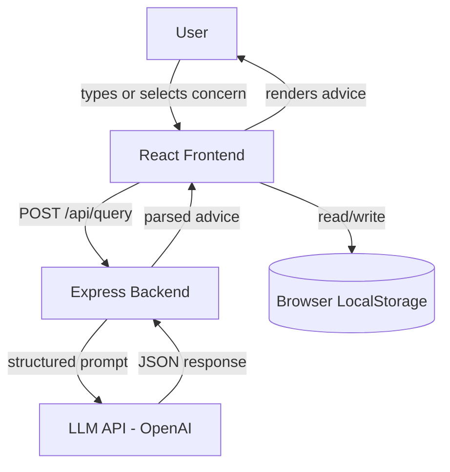

# Design Document: GlowCare AI

## Overview

GlowCare AI is a web application that provides personalized skincare advice through an AI-powered backend. Users describe skin concerns in natural language (or via quick-select buttons), and the system returns structured advice including a skincare routine, home remedies, product suggestions, and do's and don'ts. The app also surfaces daily tips and persists query history in local storage.

The architecture is a lightweight client-server model: a React frontend communicates with a Node.js/Express backend that proxies requests to an LLM API (OpenAI). This keeps the API key server-side and allows prompt engineering to be centralized.



---

## Architecture

### Stack

- **Frontend**: React (TypeScript), Tailwind CSS for styling
- **Backend**: Node.js + Express (TypeScript)
- **AI Integration**: OpenAI Chat Completions API (GPT-4o or GPT-3.5-turbo)
- **Storage**: Browser `localStorage` for query history and daily tip state
- **Deployment**: Frontend and backend can be served together (Express serves the built React app) or separately

### Request Flow

1. User submits a query (typed or via Quick Option)
2. Frontend POSTs to `POST /api/query` with `{ input: string }`
3. Backend constructs a structured prompt and calls the OpenAI API
4. OpenAI returns a JSON-structured response
5. Backend parses and validates the response, then returns it to the frontend
6. Frontend renders the structured advice and saves the entry to localStorage

### Key Design Decisions

- **Server-side API key**: The LLM API key is never sent to the client. All LLM calls go through the Express backend.
- **Structured JSON output**: The prompt instructs the LLM to return a strict JSON schema. This makes parsing reliable and avoids fragile string parsing.
- **localStorage for history**: No user accounts are required. History is scoped to the browser, keeping the app stateless on the server.
- **Streaming optional**: The backend can stream the LLM response using SSE (Server-Sent Events) to meet the 5-second first-byte requirement, but the initial implementation uses a single response for simplicity.

---

## Components and Interfaces

### Frontend Components

```
src/
  components/
    QueryInput.tsx         # Text input + submit button
    QuickOptions.tsx       # Row of quick-select concern buttons
    AdviceCard.tsx         # Renders structured AI response
    SkinTypeTag.tsx        # Displays detected skin type badge
    DermatologistAlert.tsx # Warning banner for flagged concerns
    DailyTip.tsx           # Daily tip display
    HistoryList.tsx        # List of past queries
    HistoryItem.tsx        # Single history entry
    LoadingSpinner.tsx     # Loading state indicator
  pages/
    Home.tsx               # Main query + advice view
    History.tsx            # Query history view
  hooks/
    useQueryHistory.ts     # localStorage read/write for history
    useDailyTip.ts         # Daily tip rotation logic
  services/
    api.ts                 # fetch wrapper for POST /api/query
  types/
    index.ts               # Shared TypeScript types
```

### Backend Modules

```
server/
  index.ts                 # Express app entry point
  routes/
    query.ts               # POST /api/query handler
  services/
    llm.ts                 # OpenAI API client + prompt builder
    parser.ts              # Parse and validate LLM JSON response
  middleware/
    errorHandler.ts        # Global error handler
```

### API Contract

**POST /api/query**

Request:
```json
{ "input": "I have oily skin with frequent breakouts" }
```

Response (success):
```json
{
  "skinType": "Oily",
  "routine": {
    "morning": ["Gentle foaming cleanser", "Niacinamide serum", "Oil-free SPF 30"],
    "night": ["Salicylic acid cleanser", "Retinol (2-3x/week)", "Light moisturizer"]
  },
  "homeRemedies": ["Apply diluted tea tree oil to spots", "Use a honey mask weekly"],
  "productSuggestions": ["CeraVe Foaming Cleanser", "The Ordinary Niacinamide 10%"],
  "dosAndDonts": {
    "dos": ["Drink plenty of water", "Change pillowcases weekly"],
    "donts": ["Avoid heavy oil-based moisturizers", "Don't over-wash your face"]
  },
  "dermatologistFlag": false
}
```

Response (error):
```json
{ "error": "Unable to process your request. Please try again." }
```

---

## Data Models

### TypeScript Types (shared)

```typescript
export type SkinType = "Dry" | "Oily" | "Combination" | "Sensitive" | null;

export interface SkincareRoutine {
  morning: string[];
  night: string[];
}

export interface DosAndDonts {
  dos: string[];
  donts: string[];
}

export interface AdviceResponse {
  skinType: SkinType;
  routine: SkincareRoutine;
  homeRemedies: string[];
  productSuggestions: string[];
  dosAndDonts: DosAndDonts;
  dermatologistFlag: boolean;
}

export interface QueryHistoryEntry {
  id: string;           // UUID
  timestamp: number;    // Unix ms
  input: string;
  response: AdviceResponse;
}
```

### localStorage Schema

- Key: `glowcare_history` → `QueryHistoryEntry[]` (JSON serialized, newest first)
- Key: `glowcare_last_tip_date` → `string` (ISO date, e.g. `"2024-01-15"`)
- Key: `glowcare_last_tip_index` → `number`

### Prompt Template

The backend constructs the following system + user prompt:

```
System: You are GlowCare AI, a friendly skincare advisor. 
Analyze the user's skin concern and respond ONLY with valid JSON matching this schema:
{
  "skinType": "Dry" | "Oily" | "Combination" | "Sensitive" | null,
  "routine": { "morning": string[], "night": string[] },
  "homeRemedies": string[],
  "productSuggestions": string[],
  "dosAndDonts": { "dos": string[], "donts": string[] },
  "dermatologistFlag": boolean
}
Use simple, conversational language. Only suggest safe, widely available products.
Set dermatologistFlag to true if the concern sounds like it needs medical attention.

User: {userInput}
```

---

## Correctness Properties

*A property is a characteristic or behavior that should hold true across all valid executions of a system — essentially, a formal statement about what the system should do. Properties serve as the bridge between human-readable specifications and machine-verifiable correctness guarantees.*

### Property 1: Empty input is rejected without API call

*For any* input string composed entirely of whitespace characters (or the empty string), submitting it should trigger a validation error, the API service should not be called, and the query list should remain unchanged.

**Validates: Requirements 1.3**

---

### Property 2: Loading state shows indicator

*For any* query submission that is in-flight (loading state is `true`), the loading indicator component should be present in the rendered output.

**Validates: Requirements 1.4**

---

### Property 3: Query submission passes input to API

*For any* non-empty input string, submitting the query should result in the API service being called with exactly that input string.

**Validates: Requirements 1.2**

---

### Property 4: Quick option populates input and submits

*For any* Quick Option button, clicking it should set the text input value to the option's label text and trigger a query submission with that text.

**Validates: Requirements 2.2**

---

### Property 5: Quick option selection is visually highlighted

*For any* Quick Option, after it is selected, that button should have the active/highlighted CSS class applied, and no other quick option button should have that class.

**Validates: Requirements 2.3**

---

### Property 6: Parsed skin type is always a valid value

*For any* LLM JSON response processed by the parser, the resulting `skinType` field must be one of `"Dry"`, `"Oily"`, `"Combination"`, `"Sensitive"`, or `null` — never any other value.

**Validates: Requirements 3.1**

---

### Property 7: Skin type badge renders if and only if skin type is non-null

*For any* `AdviceResponse`, the rendered `AdviceCard` should display the skin type badge when `skinType` is non-null, and should not display it (or prompt for more detail) when `skinType` is `null`.

**Validates: Requirements 3.2, 3.3**

---

### Property 8: All four advice sections are present in parsed response

*For any* valid LLM JSON response, the parser should produce an `AdviceResponse` where `routine` (with `morning` and `night` arrays), `homeRemedies`, `productSuggestions`, and `dosAndDonts` (with `dos` and `donts` arrays) are all present and non-empty arrays.

**Validates: Requirements 4.1**

---

### Property 9: Dermatologist flag triggers advisory message

*For any* `AdviceResponse` where `dermatologistFlag` is `true`, the rendered output should contain the advisory message "This concern may need professional attention — please consult a dermatologist."

**Validates: Requirements 4.4**

---

### Property 10: Rendered advice contains labeled sections

*For any* `AdviceResponse`, the rendered `AdviceCard` should contain visible section headings for all four sections: Skincare Routine, Home Remedies, Product Suggestions, and Do's and Don'ts.

**Validates: Requirements 4.5**

---

### Property 11: Daily tips do not repeat on consecutive days

*For any* pair of consecutive calendar dates, the tip returned by `useDailyTip` for day N should differ from the tip returned for day N+1.

**Validates: Requirements 6.2**

---

### Property 12: Query history round trip

*For any* query input string and its corresponding `AdviceResponse`, after saving the entry via `useQueryHistory`, reading from localStorage should return an entry containing that exact input and response.

**Validates: Requirements 7.1**

---

### Property 13: History is ordered newest first

*For any* set of `QueryHistoryEntry` items with distinct timestamps, the list rendered by `HistoryList` should display entries in descending timestamp order (most recent first).

**Validates: Requirements 7.2**

---

### Property 14: Selecting a history entry displays its response

*For any* `QueryHistoryEntry` in the history list, selecting it should cause the full `AdviceResponse` associated with that entry's `id` to be displayed.

**Validates: Requirements 7.3**

---

### Property 15: Clear history results in empty state

*For any* non-empty history state, calling the clear history action should result in localStorage containing an empty array for `glowcare_history`, and the history view should render the empty state.

**Validates: Requirements 7.4**

---

### Property 16: Prompt contains user input and required instructions

*For any* user input string, the prompt constructed by the backend `llm.ts` service should contain that input string, a reference to skin type classification, and instructions for all four structured advice sections.

**Validates: Requirements 8.2**

---

### Property 17: LLM API errors return user-friendly messages

*For any* error thrown by the LLM API client (network error, rate limit, invalid response, etc.), the backend error handler should return a response with a user-friendly `error` string that does not expose internal error details, stack traces, or the API key.

**Validates: Requirements 8.3**

---

## Error Handling

### Frontend

| Scenario | Behavior |
|---|---|
| Empty/whitespace input submitted | Inline validation message shown; no API call made |
| API call in progress | Loading spinner shown; submit button disabled |
| API returns error response | Error message displayed with retry button |
| API timeout (>30s) | Timeout error message displayed with retry button |
| localStorage unavailable | History and daily tip features degrade gracefully; core advice still works |
| LLM returns malformed JSON | Parser returns a structured error; frontend shows generic error message |

### Backend

| Scenario | Behavior |
|---|---|
| OpenAI API key missing | Server fails to start with a clear configuration error |
| OpenAI returns non-200 | Error logged server-side; `{ error: "..." }` returned to client |
| OpenAI returns invalid JSON | Parser catches parse error; logs raw response; returns user-friendly error |
| Request body missing `input` | 400 Bad Request with validation message |
| Input exceeds max length | 400 Bad Request; input capped at 1000 characters |

---

## Testing Strategy

### Dual Testing Approach

Both unit tests and property-based tests are required. They are complementary:
- Unit tests catch concrete bugs with specific examples and edge cases
- Property-based tests verify universal correctness across all inputs

### Unit Tests

Focus areas:
- Specific rendering examples (e.g., AdviceCard renders all sections for a known fixture)
- Integration between components (e.g., selecting a quick option triggers submission)
- Edge cases: null skinType, empty history, dermatologistFlag true/false
- Error states: API error, timeout, malformed JSON from LLM

### Property-Based Tests

**Library**: [fast-check](https://github.com/dubzzz/fast-check) (TypeScript/JavaScript)

Each property test must run a minimum of **100 iterations**.

Each test must include a comment tag in the format:
`// Feature: glowcare-ai, Property {N}: {property_text}`

| Property | Test Description |
|---|---|
| P1 | Generate whitespace-only strings; assert no API call and validation error shown |
| P2 | Generate any query; set loading=true; assert spinner is rendered |
| P3 | Generate any non-empty string; assert API called with that string |
| P4 | Generate any quick option; assert input populated and submission triggered |
| P5 | Generate any quick option selection; assert only that button is highlighted |
| P6 | Generate arbitrary LLM JSON strings; assert parser output skinType is in valid set or null |
| P7 | Generate AdviceResponse with random skinType (including null); assert badge presence matches non-null |
| P8 | Generate valid LLM JSON; assert all four sections present and non-empty |
| P9 | Generate AdviceResponse with dermatologistFlag=true; assert advisory text present |
| P10 | Generate any AdviceResponse; assert all four section headings present in render |
| P11 | Generate pairs of consecutive dates; assert tip differs between days |
| P12 | Generate random query+response pairs; save then read; assert round-trip equality |
| P13 | Generate random history entries with distinct timestamps; assert rendered order is descending |
| P14 | Generate history with random entries; select one; assert correct response displayed |
| P15 | Generate non-empty history; clear; assert empty state |
| P16 | Generate any input string; assert constructed prompt contains input and required instructions |
| P17 | Generate various error types from LLM client; assert user-friendly error returned without internals |

### Test File Structure

```
src/
  __tests__/
    unit/
      AdviceCard.test.tsx
      QuickOptions.test.tsx
      HistoryList.test.tsx
      DailyTip.test.tsx
    property/
      inputValidation.property.test.ts
      adviceParser.property.test.ts
      queryHistory.property.test.ts
      promptBuilder.property.test.ts
      errorHandler.property.test.ts
```
